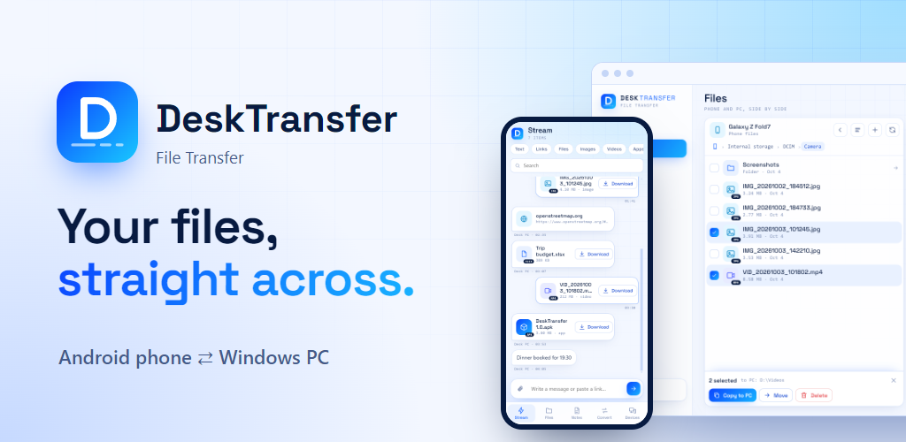
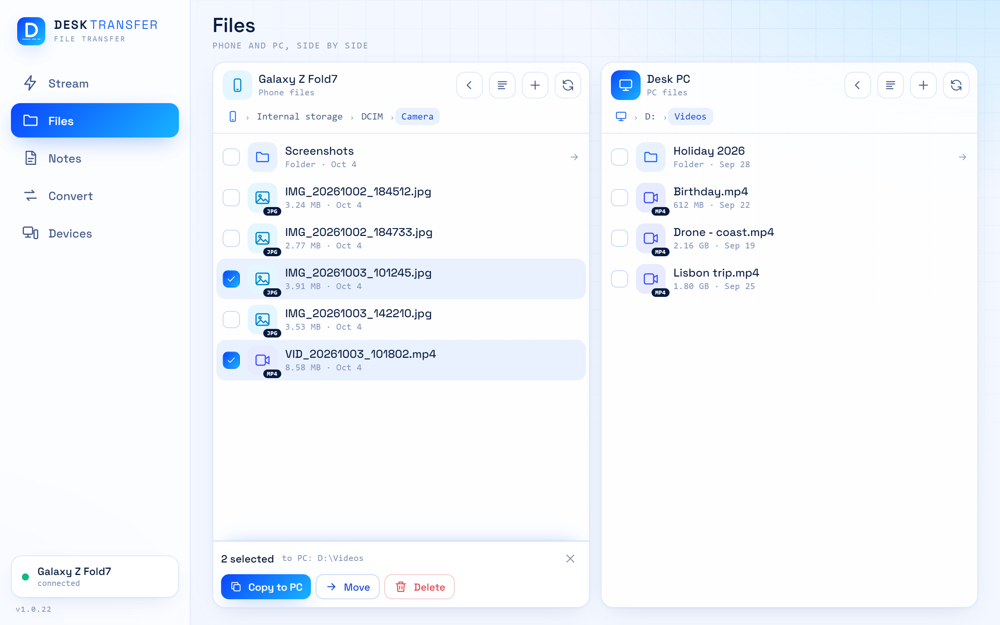
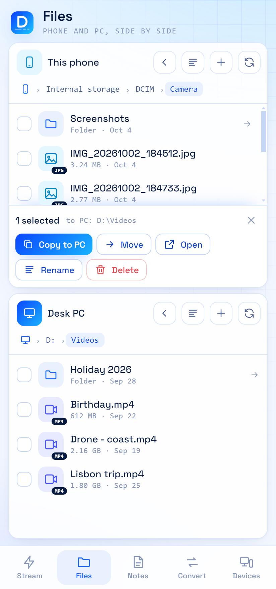
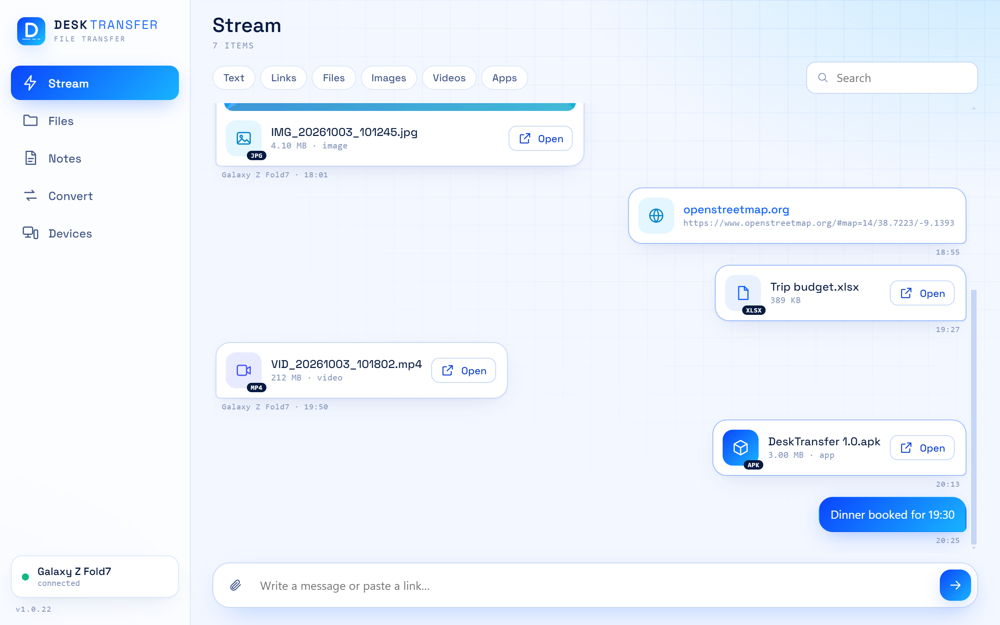

# DeskTransfer : File Transfer

Move files, apps, notes and links between your **Android phone** and your **Windows PC**, directly over your own network. No cloud, no account, no ads.

**Website:** [desktransfer.app](https://desktransfer.app) · **Help:** [desktransfer.app/help](https://desktransfer.app/help) · **Contact:** contact@desktransfer.app

## Get it

| For | How |
| --- | --- |
| **Windows 10 and 11** | [Download from desktransfer.app](https://desktransfer.app/#download) |
| **Android 7 or newer** | In closed testing on Google Play, open to everyone soon. [Join the test](#try-the-android-app-early) |

You need both: the PC program is the hub, the phone app connects to it. The PC must be switched on for the phone to reach it.

Windows shows an "unknown publisher" warning when you run the installer, because it is not code-signed yet. Choose **More info**, then **Run anyway**. The [help page](https://desktransfer.app/help) shows how to check the download against its SHA-256 checksum.

## What it does

- **Files.** A two-pane file manager: your phone's folders on one side, your PC's folders on the other. Tick files or whole folders and copy or move them across, in either direction. Rename, delete and create folders on both sides.
- **Stream.** A "send to myself" thread shared by your devices, for text, links, files and app files. Share to DeskTransfer from any Android app.
- **Convert.** Images, documents, video and audio into other formats, plus zip and unzip. The PC does the work, so the phone stays cool.
- **Notes.** A notebook that is the same on the phone and the PC. Write offline; it syncs when the PC is in reach again.
- **At home and away.** Over your Wi-Fi at home, and through [Tailscale](https://tailscale.com) when you are away, if you use it.

  
  &nbsp;&nbsp;
  

## Private by design

- No account, no ads, no analytics, no tracking.
- Everything between phone and PC is encrypted, and the phone only talks to the PC you linked it with.
- There are no servers of ours. Your files go from one of your devices to the other and nowhere else.
- The app never contacts the website or anything else by itself: no update check, no telemetry.
- On the PC you decide whether a linked phone may reach all folders or only one.

[Privacy policy](https://desktransfer.app/privacy) · [Terms of use](https://desktransfer.app/terms) · [Open-source libraries used](https://desktransfer.app/licenses)

## Try the Android app early

The Android app is in closed testing. To join, in this order:

1. [Join the testers group](https://groups.google.com/g/desktransfer-testers)
2. [Become a tester](https://play.google.com/apps/testing/com.desktransfer.app)
3. [Install it from Google Play](https://play.google.com/store/apps/details?id=com.desktransfer.app)

The store link only works after the first two steps.

## Found a problem? Have an idea?

[Open an issue](../../issues/new/choose). Say what you did, what you expected and what happened, and which versions you have (Devices, About, on both the PC and the phone).

For anything about security, please do not open a public issue: write to contact@desktransfer.app. See [SECURITY.md](SECURITY.md).

## Good to know

- **Is it free?** Yes. If it is useful to you, you can [buy me a coffee](https://buymeacoffee.com/nhympex).
- **Is there a version for Mac, Linux or iPhone?** No. Windows on the PC side, Android on the phone side.
- **Where is the source code?** It is not published at this time. This page is for information, downloads and bug reports.
- **Who makes it?** One independent developer.

Also from the same maker: [DeskEditor : PDF Editor](https://desktransfer.app/deskeditor) for Android, coming soon.

---

© DeskTransfer. All rights reserved. DeskTransfer is free to use; the name, the logo and the pictures on this page may not be reused without permission.
